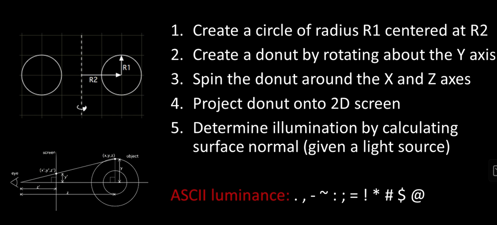

# 3D Animations using Legacy and Web-based Technologies

## Project Description

To advance my understanding of low-level languages like C & C++, I decided to replicate 3D Animations projects available on YouTube. Due to the fact that native code is platform-dependent, I also added a platform-independent JavaScript/React version of the same program that ouputs the animation to your default web browser at the port `http://localhost:3000`.
In terms of execution and compiling speed, the C code is a much better option than the web app. However, it requires the user to have the latest gcc compiler version (I have 13.1.0), and some understanding of low level languages. More importantly, the C code may have undetectable performance differences across the latest hardware because of its simplicity. To ensure its viability across different operating systems, the C app needs to be compiled in all the mainstream operating systems that support the latest gcc compiler. This means that software incompatibility issues may arise if using outdated hardware or old version of the C compiler. For this reason, I included a web version of the same 3D animation that elminates the requirement of the gcc compiler specific to your OS, understanding of low-level languages, and expertise in troubleshooting errors in C/C++.

## Resources
Among the several tutorial on YouTube that cover the spinning torus project in C/C++, this stood out the most to me.
Lex Fridman's tutorial at `https://www.youtube.com/watch?v=DEqXNfs_HhY` delivers a brief overview of the project and the literature behind, including Andy Sloane's math explanation & JS code at `https://www.a1k0n.net/2011/07/20/donut-math.html`.

"Lex Fridman's explanation of the C code"

While I kept Lex Fridman's C code as is, I made minor changes to Andy Sloane's JS version to fit the app into a React project for better portability across mobile devices.

In his tutorial, Green Code explains how the 3D torus/donut gets its 3D effect. The donut is displayed on to the terminal using ASCII characters, alist of letters, numbers, and symbols. To create the illusion that the donut has three dimensions, making it look brighter on certain sides, the C program calculates the dot product by multiplying the surface normal and the light direction via rotation matrices. Then, it assigns the `@` sign to the donut's brightest part, and the `.` sign to its least bright side. In between, go all the other ASCII characters in order of brightness (`https://www.youtube.com/watch?v=74FJ8TTMM5E&t=10s`).

Giovanni Code's tutorial goes deep into Andy Sloane's math explanation and provides a Python version of the C code that you can follow at `https://www.youtube.com/watch?v=LqQ-ezbyiW4` & `https://github.com/codegiovanni/Donut_2.0`.

Below are interesting resources covering how the C compiler performs Math calculations featured in the donut program:

1. Math library in C, stackoverflow: `https://stackoverflow.com/questions/2284860/how-does-c-compute-sin-and-other-math-functions`

2. Math libary in C, geeksforgeeks: `https://www.geeksforgeeks.org/sin-in-c/`

